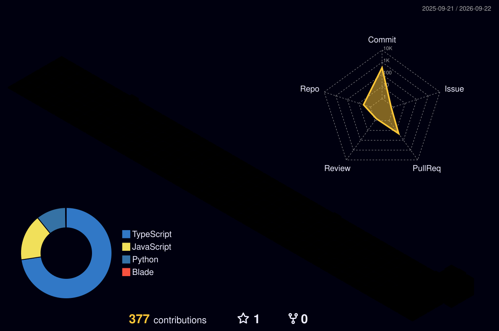

<!-- ═══════════════════ HEADER ═══════════════════ -->
<div align="center">



<br/><br/>

<a href="https://arielalfath.vercel.app/"></a>
<a href="https://instagram.com/arielalfth"></a>
<a href="https://tiktok.com/@ariellfath"></a>
<a href="mailto:nazrielrahman5940@gmail.com"></a>


</div>



<!-- ═══════════════════ ABOUT ═══════════════════ -->
##  &nbsp;About Me

<div align="center">



</div>

**Fullstack developer** from Samarinda, Indonesia 🇮🇩

Studying at **Universitas Muhammadiyah Kalimantan Timur**, where I also work as a **Teaching Assistant** and **Lab Assistant** — which mostly means explaining the same pointer bug in six different ways until it clicks. The rest of my time goes to building systems that turn messy data into something people can actually decide with, mostly on **Laravel** and **Next.js**.

> 🎓 &nbsp;**Campus** &nbsp;·&nbsp; UMKT — Teaching Assistant &amp; Lab Assistant
>
> 🎯 &nbsp;**Focus** &nbsp;·&nbsp; Backend architecture, database design, and clean fullstack delivery
>
> 🌱 &nbsp;**Learning** &nbsp;·&nbsp; AHP with Python &nbsp;·&nbsp; Web3 &nbsp;·&nbsp; Advanced Next.js
>
> 💬 &nbsp;**Ask me about** &nbsp;·&nbsp; Laravel &amp; Next.js in production, picking a stack without regret, stocks &amp; crypto
>
> 🤝 &nbsp;**Open to** &nbsp;·&nbsp; Collaboration &nbsp;·&nbsp; Freelance &nbsp;·&nbsp; Smart Robots &amp; IoT
>
> ☕ &nbsp;**Fueled by** &nbsp;·&nbsp; Coffee, always &nbsp;·&nbsp; 🍛 nasi goreng &nbsp;·&nbsp; 🍗 KFC
>
> ⚡ &nbsp;**Off the clock** &nbsp;·&nbsp; 🎮 Mobile Legends rank grind &nbsp;·&nbsp; 🏖️ beach at sunset


<!-- ═══════════════════ STATS ═══════════════════ -->
##  &nbsp;Stats

<div align="center">



<sub>Generated daily from the GitHub API with my own token — private repositories included.</sub>

</div>


<!-- ═══════════════════ TECH STACK ═══════════════════ -->
##  &nbsp;Tech Stack

<div align="center">

**Languages**


**Frontend**


**Backend & Frameworks**


**Database**


**DevOps, Cloud & Tools**


**IoT & Emerging**


</div>


<!-- ═══════════════════ WAKATIME ═══════════════════ -->
##  &nbsp;What I Actually Commit

<div align="center">



<sub>Lines added and removed per language across every repo I own — private ones included.</sub>

</div>


##  &nbsp;Coding Time

<!--START_SECTION:waka-->

```txt
Markdown   6 mins                █████████████░░░░░░░░░░░░   52.58 %
YAML       5 mins                ████████████░░░░░░░░░░░░░   47.42 %
```

<!--END_SECTION:waka-->


<!-- ═══════════════════ CONTRIBUTIONS ═══════════════════ -->
##  &nbsp;Contributions

<div align="center">



<br/><br/>

<picture>
  <source media="(prefers-color-scheme: dark)" srcset="https://raw.githubusercontent.com/ArielWebDev/ArielWebDev/output/github-snake-dark.svg" />
  <source media="(prefers-color-scheme: light)" srcset="https://raw.githubusercontent.com/ArielWebDev/ArielWebDev/output/github-snake.svg" />
  
</picture>

</div>


<!-- ═══════════════════ SPOTIFY ═══════════════════ -->
##  &nbsp;Now Playing

<div align="center">

<!-- Widget by https://github.com/kittinan/spotify-github-profile -->
<a href="https://open.spotify.com/user/1z8jkmnajsxtn4lmzl72sp6ks">
  
</a>

</div>


<!-- ═══════════════════ CONNECT ═══════════════════ -->
##  &nbsp;Let's Connect

<div align="center">

<a href="https://arielalfath.vercel.app/"></a>
<a href="https://instagram.com/arielalfth"></a>
<a href="https://tiktok.com/@ariellfath"></a>
<!-- TODO: ganti LINKEDIN_USERNAME kalau akun sudah dibuat -->
<a href="https://linkedin.com/in/LINKEDIN_USERNAME"></a>
<a href="https://github.com/ArielWebDev"></a>

<br/><br/>

<sub><i>"Code, Collaborate, and Conquer Challenges."</i></sub>

<br/>

<sub>Built with matcha and too many browser tabs.</sub>

</div>


